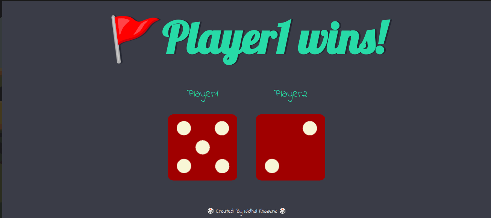

# Dicee Game 🎲

This is a simple dice game built with HTML, CSS, and JavaScript. The game allows two players to roll a dice and determine the winner based on the highest number rolled.

## Demo

## How to Play

1. Open the `index.html` file in a web browser.
2. The page will automatically roll two dice for Player 1 and Player 2.
3. The result will be displayed at the top, indicating which player wins or if it's a draw.
4. Refresh the page to play again!

## Technologies Used

- **HTML**: Provides the structure of the game.
- **CSS**: Used for styling the page with a custom font and colors.
- **JavaScript**: Implements the game logic to randomly roll dice and determine the winner.

## Project Structure

